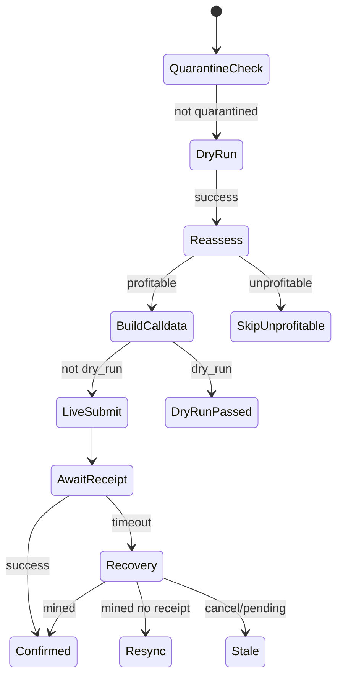

# Polarb (rpbot) — System Architecture Master Map

> Polygon mainnet MEV arbitrage bot. Rust 2024, Tokio async runtime, jemalloc global allocator.
> TypeScript-specific rules from the review brief are mapped to Rust equivalents throughout.

---

## 1. Executive Data Flow

```mermaid
flowchart TB
    subgraph entry [Entry]
        main[main.rs]
        tui[tui/bin]
    end

    subgraph config [Configuration]
        cfg[config/mod.rs]
        wallet[config/wallet.rs]
    end

    subgraph orchestrator [Orchestration]
        pl[pass_loop.rs]
        lf[lf.rs ~1s]
        hf[hf.rs ~200ms]
        hfeval[hf_eval.rs]
        hfexec[hf_execute.rs]
    end

    subgraph pipeline [Pipeline — CPU-bound]
        arena[arena.rs]
        graph[graph.rs]
        finder[cycle_finder / johnson / bellman_ford / cycle_search]
        sim[local_sim.rs]
        ternary[ternary.rs Brent]
        spot[spot_price.rs]
    end

    subgraph services [Services — shared state]
        refresh[state_refresh.rs]
        scache[state_cache.rs]
        partial[partial_cache/ WSS hot path]
        snap[hf_snapshot.rs]
        exec[execution/]
        oracle[oracle/]
    end

    subgraph infra [Infrastructure]
        rpc[rpc.rs RpcPool]
        wss[wss_feed.rs]
        hs[hypersync.rs]
        hasura[hasura.rs]
        metrics[metrics.rs]
    end

    subgraph chain [External]
        polygon[Polygon RPC / WSS]
        indexer[Hasura / Envio]
        executor[ArbExecutor Huff contract]
    end

    main --> cfg --> pl
    pl --> lf --> refresh --> hasura
    pl --> lf --> finder --> snap
    pl --> hf --> hfeval --> sim
    hf --> hfexec --> exec --> executor
    refresh --> scache --> arena
    wss --> partial --> scache
    hf --> partial
    exec --> rpc --> polygon
    lf --> oracle --> polygon
    hs --> polygon
```

---

## 2. Layer Responsibilities

| Layer | Path | Role |
|-------|------|------|
| **Entry** | `src/main.rs`, `src/bin/*` | Process bootstrap, tracing, shutdown, spawn pass loop |
| **Config** | `src/config/` | Figment TOML + env merge; wallet secret loading (zeroized) |
| **Core** | `src/core/` | Domain types (`TokenIndex`, `PoolState`, `Edge`), protocol math |
| **Pipeline** | `src/pipeline/` | Graph build, cycle enumeration, local simulation, Brent sizing |
| **Services** | `src/services/` | Caches, discovery, execution, oracle, snapshots |
| **Orchestrator** | `src/orchestrator/` | LF/HF tick scheduling, eval parallelism, dispatch |
| **Infra** | `src/infra/` | RPC pool, WSS feed, HyperSync, Hasura, metrics |
| **TUI** | `src/tui/` (feature) | Ratatui dashboard, mock mode |
| **ABIs** | `src/abis.rs` | Alloy sol! bindings for on-chain contracts |

---

## 3. Module File Reviews

### 3.1 Entry — `src/main.rs`

**Functional purpose:** Bootstraps tracing, loads config/wallet, optionally connects HyperSync, constructs `RuntimeContext`, runs dual-frequency pass loop until SIGINT/SIGTERM.

**Key components:**
- `init_tracing()` — env-filtered subscriber; optional JSON + tokio-console
- `main()` — wires `RuntimeContext`, spawns `run_pass_loop`, graceful shutdown via `watch` channel
- `shutdown_signal()` — Ctrl+C + SIGTERM (Unix)

**Dependencies:** `config`, `orchestrator`, `infra::hypersync`, `tokio`, `tracing`, `tikv-jemallocator`

**State in/out:** Expects `.env` / TOML; passes `Arc<RuntimeContext>` + shutdown receiver to pass loop.

**Risks:**
- `expect` on signal handlers — acceptable for process entry
- No explicit config validation beyond `AppConfig::load` — **Fixed:** `validate()` after wallet load

**Rust ↔ TS mapping:** Entry-point fail-fast ✓; no `any` equivalent but `anyhow::Result` erases error types at boundary.

---

### 3.2 Config — `src/config/mod.rs`, `extractors.rs`, `wallet.rs`

**Functional purpose:** Single source of truth for RPC URLs, routing limits, execution thresholds, pipeline caps, oracle settings.

**Key components:**
- `AppConfig` — aggregate of `RpcConfig`, `RoutingConfig`, `ExecutionConfig`, `PipelineConfig`, `OracleConfig`
- `AppConfig::load()` — Figment merge (TOML + env aliases)
- `WalletSecrets` — loads signer, clears `private_key` from config after load (zeroize)
- `*ConfigView` extractors — narrow read-only views (Law of Demeter helper)

**Dependencies:** `figment`, `serde`, `alloy`, `zeroize`

**Risks:**
- Duplicate default constants in `util::constants` vs `config` serde defaults — drift risk
- Stringly-typed `execution.mode` — parse at use site; `cycle_finder` is now `CycleFinderKind`

**Types:** Strong structs with serde defaults; `Option<Address>` for executor.

---

### 3.3 Orchestrator — `src/orchestrator/`

#### `pass_loop.rs`
**Purpose:** Main event loop — LF background task, HF timer, block trigger (HyperSync), stream trigger (WSS partial cache).

**Key components:**
- `RuntimeContext` — **owns all long-lived pools**: RPC, caches, execution service, gas oracle, **GraphCache** (shared across LF ticks)
- `run_pass_loop()` — `tokio::select!` on HF interval, block height, stream patches
- `spawn_hf_tick()` — semaphore(1) prevents overlapping HF ticks; `dispatch_lock` prevents overlapping submits

**Integrations:** All service + infra layers.

**Risks:**
- HF tick spawns dispatch in detached `tokio::spawn` — errors only logged
- Operator balance monitor uses 30s poll — circuit breaker trip is reactive not predictive

#### `lf.rs` (~1s tick)
**Purpose:** Discover pools, refresh state, build/reuse routing graph, enumerate cycles, publish `HfSnapshot`.

**Flow:**
1. `StateRefreshService::maybe_discover` + `refresh_pool_states`
2. `StateArena::sync_from_discovery`
3. `GraphCache::get_or_build` (fingerprint = cache generation + pool count)
4. Cycle search (hybrid / johnson / bellman-ford / dfs) with optional cache hit
5. V3 tick enrichment + spot rescore (on cache miss)
6. Oracle rate enrichment
7. `SnapshotStore::publish`
8. Seed `PartialPoolCache` for WSS targets

**Risks:**
- Cycle cache hit skips spot rescore — HF tick rescores anyway
- `generation: 0` hardcoded in publish struct literal before store assigns real generation

#### `hf.rs` (~200ms tick)
**Purpose:** Rescore top cycles, prefetch hot pool states, flush partial→state cache, Brent+simulate+assess, dispatch profitable routes.

**Key invariants:**
- Rescore runs **after** hot cache overlay (ranking uses freshest prefetched state)
- Eval uses arena **after** `apply_hot_cache`
- `dispatch_lock.try_lock()` — defers rather than queues (intentional backpressure)

#### `hf_eval.rs`
**Purpose:** Parallel cycle evaluation on dedicated Rayon pool (`HF_EVAL_POOL`) to keep Tokio workers free.

**Inputs:** `HfEvalInput` / owned clone with arena + rates + gas + **flash_source** (pessimistic fee model).

**Outputs:** `HfEvalResult` with `OptimizationResult`, simulation, `ProfitAssessment`.

**Guardrail (refactored):** Assessment uses `input.flash_source` only — aligns HF ranking with dispatch flash policy (Aave pessimism in auto mode).

#### `hf_execute.rs`
**Purpose:** Flash liquidity refresh, `prepare_evaluated_route` (cap/reoptimize), build calldata candidate, `ExecutionService::process_candidate`.

---

### 3.4 Pipeline — `src/pipeline/`

| File | Purpose | Key exports |
|------|---------|-------------|
| `arena.rs` | Copy-on-write token/pool store; `hot_patches` overlay for HF | `StateArena`, `apply_hot_cache` |
| `graph.rs` | Build directed multigraph from pool metas | `build_graph`, `pool_meta_from_pair` |
| `graph_cache.rs` | Reuse graph/cycles when pool fingerprint stable | `GraphCache`, `pool_fingerprint` |
| `cycle_finder.rs` | Parallel DFS enumeration with budget | `find_cycles_multi_pass` |
| `johnson.rs` | Hub-based reweighted BF negative cycles | `find_cycles_johnson_multi_pass` |
| `bellman_ford.rs` | Multi-source BF negative cycle extraction | `find_cycles_bellman_ford_multi_pass` |
| `cycle_search.rs` | Hybrid merge + dedupe + atomic prefilter | `find_cycles_hybrid_multi_pass` |
| `cycle_filter.rs` | Dedupe by fingerprint, SPOT_PROBE prefilter | `prefilter_cycles_by_atomic_sim` |
| `negative_cycle.rs` | Extract simple cycles from BF predecessor graph | `collect_negative_cycles_from_source` |
| `weighted_graph.rs` | Log-weight adjacency, Johnson potentials | `build_weighted_adjacency`, `reweight_adjacency` |
| `spot_price.rs` | Marginal spot, hop penalty, cycle rescore | `SpotTable`, `rescore_cycles_with_table_and_gas` |
| `local_sim.rs` | Hop-by-hop swap simulation (all protocols) | `simulate_route_minimal`, `simulate_route_detailed` |
| `ternary.rs` | Brent optimal input sizing with liquidity caps | `optimize_cycle`, `get_dynamic_search_bounds` |
| `pool_fetch/` | Multicall decode → `PoolState` per protocol | `fetch_pool_states` |
| `multicall.rs` | Batched eth_call via Multicall3 | `execute_multicall` |
| `types.rs` | `PoolMeta`, `RoutingGraph`, `FoundCycle`, sim results | Shared pipeline DTOs |

**Performance patterns:**
- `SpotTable` — dense f64 cache, sequential memory (cache-friendly) ✓
- `CycleEdges = SmallVec<[Edge; 6]>` — stack allocation for typical routes ✓
- Rayon parallel DFS / hybrid search — CPU pool reuse ✓
- Lazy evaluation: cycles truncated by caps (`hf_score_cap`, `hf_sim_cap`) not full materialization ✓

**Risks:**
- `u256_to_f64` in spot scoring — precision loss for huge reserves (acceptable for ranking)
- Graph cache fingerprint ignores pool *topology* changes without generation bump — generation bumps on every cache insert/patch ✓

---

### 3.5 Services — `src/services/`

#### `state_cache.rs`
**Purpose:** TTL LRU-ish pool state cache with generation counter for graph invalidation.

**RAII:** Entries hold `Arc<PoolState>` — cheap clones; eviction on TTL expiry.

**API:** `get`, `insert`, `patch_pool` (in-place mutation with generation bump), `classify_for_fetch`.

#### `state_refresh.rs`
**Purpose:** Hasura discovery feed, LF/HF refresh batch scheduling, dead pool pruning, hot address tracking.

#### `partial_cache/`
**Purpose:** Lock-free `DashMap` of slim V2/V3 snapshots; WSS log decode; stream trigger for HF.

**Failure isolation:** `decode_pool_log` returns `None` on bad data — no panic.

#### `hf_snapshot.rs`
**Purpose:** Lock-free snapshot publish via `arc_swap::ArcSwap<HfSnapshot>` — HF readers never block LF writer.

#### `execution/` (see §4)

#### `oracle/`
**Purpose:** Chainlink + Pyth Hermes token/USD → MATIC rate enrichment for profit scoring.

---

### 3.6 Execution Subsystem — `src/services/execution/`



| File | Purpose |
|------|---------|
| `service.rs` | Orchestrates dry-run → submit → receipt; quarantine; circuit breaker integration |
| `candidate.rs` | Build `CandidateExecution` from evaluated route + calldata |
| `calldata/` | Protocol encoders (V2/V3/V4/Balancer/Curve/Dodo/Woofi/Kyber) |
| `profit.rs` | `assess_profit` — gas, flash fee, slippage, safety multiplier |
| `flash_liquidity.rs` | On-chain Balancer/Aave liquidity; cap-and-reoptimize |
| `nonce.rs` | Serial nonce manager; in-flight guard; resync on recovery |
| `submit.rs` | EIP-1559 fees, profit-scaled priority fee, retry with bump |
| `recovery.rs` | Receipt timeout → drop detection, cancel tx, mark stale |
| `circuit_breaker.rs` | Global pause on consecutive failures / low operator balance |
| `gas_oracle.rs` | Background base fee polling |
| `dryrun.rs` | `eth_call` simulation |
| `receipt.rs` | Poll + optional HyperSync fast path |
| `impact_slippage.rs` | Depth-based slippage bump for HF eval |

**Idempotency:**
- Route fingerprint quarantine + cooldown — replay-safe ✓
- Nonce manager serializes submits — no double-spend ✓
- `SubmitAction::AlreadyKnown` returns existing hash ✓

**Circuit breaker:** `CircuitBreaker` on execution service; operator balance monitor trips on low MATIC.

---

### 3.7 Core — `src/core/`

**`types.rs`** — Domain newtypes (`TokenIndex`, `PoolIndex`), `ProtocolType` enum, `PoolState` discriminated union, `Edge`, `FoundCycle`, `EvaluatedRoute`, `ProfitAssessment`, `ExecutionOutcome`-adjacent types.

**Rust ↔ TS:** `PoolState` is a proper discriminated union (GOOD). `TokenIndex(u32)` is a weak newtype — consider `struct TokenIndex(NonZeroU32)` for stronger invariants.

**`core/math/`** — Pure functions mirroring on-chain math (UniV2/V3, Balancer, Curve, Dodo, Woofi). No I/O. Deterministic.

**`protocol.rs`** — Fee normalization, fetchability checks.

---

### 3.8 Infra — `src/infra/`

| File | Purpose |
|------|---------|
| `rpc.rs` | `RpcPool` — state / simulation / private submit URL routing |
| `wss_feed.rs` | Chunked `eth_subscribe` logs → partial cache |
| `hypersync.rs` | Envio HyperSync block height + receipt lookup |
| `hasura.rs` | GraphQL pool/token discovery |
| `metrics.rs` | Atomic pipeline counters (HF/LF ticks, dispatches, txs) |
| `tracing_util.rs` | Span field helpers |

**Resource pooling:** Shared `reqwest::Client` in `RpcPool` (connection pool per host). Providers still built per `connect_*` call but reuse HTTP pool.

---

### 3.9 TUI — `src/tui/` (feature `tui`)

**Purpose:** Ratatui dashboard; `UiBridge` channel receives HF/LF updates from orchestrator via `TuiUiHook` implementing `PipelineUiHook`.

**Files:** `app.rs`, `run.rs`, `update.rs`, `bridge.rs`, `widgets/*`, `mock.rs` for demo mode.

**Isolation:** Fully feature-gated; no impact on headless bot.

---

## 4. Cross-File Logical Contraints & Contradictions

| Issue | Location | Severity | Status |
|-------|----------|----------|--------|
| HF eval used optimistic Balancer fee while dispatch uses policy | `hf_eval.rs` vs `flash_liquidity.rs` | Medium | **Fixed** — eval uses `flash_source` |
| Receipt timeout `Mined` branch left nonce in-flight | `execution/service.rs` | Critical | **Fixed** — resync on failed second poll |
| Flash cap bounds could exceed liquidity | `ternary.rs` | Medium | **Fixed** — cap-aware min-width |
| HF rescore before hot cache; eval after | `hf.rs` | Low | **Fixed** — rescore after prefetch + hot cache |
| Eval depth slippage vs dispatch reassess base slippage | `hf_eval.rs` vs `hf_execute.rs` | Low | **Fixed** — dispatch uses `effective_slippage_bps` |
| ~~`util::constants` duplicates config defaults~~ | `util.rs` vs `config/mod.rs` | Low | **Removed** |
| ~~`lib.rs` blanket `clippy::allow`~~ | `lib.rs` | Medium | **Narrowed** — hot-path lints only |
| ~~`cursor_debug_log` agent artifact~~ | `util.rs` | Low | **Removed** |
| `GraphCache` recreated per `lf_context()` call | `pass_loop.rs` | Medium | **Fixed** — shared on `RuntimeContext` |
| Provider not pooled in `RpcPool` | `infra/rpc.rs` | Medium | **Fixed** — shared reqwest client |
| `lf.rs` publishes `generation: 0` in struct literal | `lf.rs` | Cosmetic | Overwritten by `SnapshotStore::publish` |

---

## 5. Engineering Principles Audit (Rust Mapping)

| Principle | Status | Notes |
|-----------|--------|-------|
| **RAII** | Strong | `Arc`, `ArcSwap`, locks; Tokio tasks tied to shutdown channel |
| **Idempotent ops** | Strong | Route quarantine, nonce serial, AlreadyKnown submit |
| **Resource pools** | Strong | Rayon HF eval pool ✓; reqwest HTTP pool ✓; jemalloc ✓ |
| **Fail fast at boundary** | Strong | Config load + `validate()` ✓; pool fetch decodes silently skip ✓ |
| **Law of Demeter** | Partial | Config views help; deep `ctx.execution.flash_liquidity.snapshot` chains in dispatch |
| **Circuit breakers** | Strong | Execution + operator balance |
| **Immutability** | Strong | `HfSnapshot` published atomically; arena COW |
| **Lazy evaluation** | Strong | Cycle caps, streaming WSS patches |
| **Cache locality** | Strong | `SpotTable`, `SmallVec`, dense arena |
| **Zero `any` (→ no silent casts)** | Partial | Rust types strong; `anyhow` at boundaries; few `expect` in hot path |
| **Branded types** | Partial | `TokenIndex`/`PoolIndex` exist but are thin wrappers |
| **Discriminated unions** | Strong | `PoolState`, `ExecutionOutcome`, `FlashPlanAction` |

---

## 6. Recommended Refactor Backlog (Priority Order)

### P0 — Correctness / Guardrails
1. ~~Align HF eval flash fee with dispatch policy~~ ✓
2. ~~Pool `Provider` instances in `RpcPool` (shared reqwest client)~~ ✓
3. ~~Validate `AppConfig` at load (typed `cycle_finder`, live-mode RPC checks)~~ ✓

### P1 — Cognitive Load / Structure
4. ~~Remove dead `util::constants` module~~ ✓
5. ~~Narrow `lib.rs` clippy allows~~ ✓
6. ~~Extract `FlashLoanPolicy` + parsers → `flash_policy.rs`~~ ✓
7. ~~Pass `effective_slippage_bps` through dispatch~~ ✓

### P2 — Performance
8. ~~HF rescore after hot cache apply~~ ✓
9. Batch flash liquidity refresh across dispatch (already batched per tick ✓)

### P3 — Architecture
10. ~~Split `pool_fetch.rs` by protocol encoder pattern~~ ✓ (`pool_fetch/{mod,plans,decode}.rs`)
11. ~~Feature-gate TUI via `PipelineUiHook` trait~~ ✓ (`ui_hook.rs`, `tui/hook.rs`)

---

## 7. Dependency Rules (Intended)

```
main → orchestrator → services → pipeline → core
                   ↘ infra ↗
pipeline ↛ orchestrator   (no upward deps)
core ↛ pipeline           (pure domain + math)
```

**Violations:** None critical — `pipeline/arena` imports `services::discovery` for sync (acceptable infrastructure coupling).

---

## 8. External Integrations

| System | Client | Used by |
|--------|--------|---------|
| Polygon RPC | alloy `Provider` | pool_fetch, execution, oracle, gas_oracle |
| Polygon WSS | alloy pubsub | wss_feed → partial_cache |
| Hasura/Envio | reqwest GraphQL | hasura → discovery |
| HyperSync | hypersync-client | block trigger, receipt fast path |
| Pyth Hermes | reqwest | price_oracle |
| Chainlink | eth_call | price_oracle |
| ArbExecutor | calldata + submit | execution |

---

## 9. Test & Bench Coverage

| Area | Tests | Benches |
|------|-------|---------|
| Core math | inline `#[cfg(test)]` | — |
| Pipeline sim/search | cycle_finder, ternary, graph_cache | `cycle_finder`, `local_sim`, `spot_price`, `hf_tick` |
| Execution | nonce, profit, submit, flash_liquidity, calldata encoders | — |
| Integration | `tests/calldata_parity.rs` (TS parity) | — |

**Gaps:** No integration test for full HF tick; no mock provider tests for execution service state machine.

---

*Generated: 2026-06-22. Refactor backlog (P0–P3) implemented in this series.*
